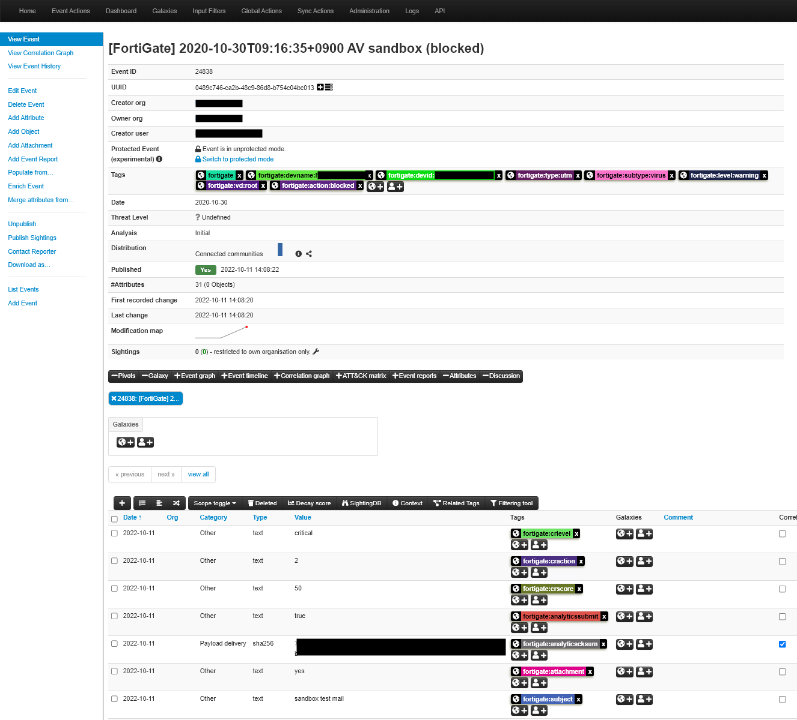

# fortigate_to_misp

## Overview

Register security logs generated by FortiGate's IPS, antivirus, web filter, sandbox, etc. to MISP.

By registering FortiGate security logs with MISP, you can manage daily security events and perform threat analysis using MISP.
This script provides a function to read log files directly downloaded from FortiGate or transferred from FortiGate to syslog server and register them with MISP.

## License

This software is released under the BSD license.
Please refer to the included LICENSE.txt.

## Enviroment

* Python 3.6 or newer
* pymisp 2.4.160.1 or newer
* MISP 2.4.160 or newer

## Python module

* `pip3 install pymisp`

## How to use

### 1 Checking FortiGate Logs

* This program assumes an environment in which logs that can be obtained from FortiGate are accumulated in any directory.
Memorize the name of the last file read in any directory, and read the file names after that in ascending order of sorting.
In the syslog settings, please set it so that it accumulates daily with a file name like yyyy-mm-dd.log.

* Logs obtained from syslog have dates and IP addresses before the logs depending on the settings.
FortiGate logs start with the character string date=, so this program cuts out and reads the character string and beyond.
Therefore, set syslog so that only the log output from FortiGate is displayed after date=.

### 2 Settings

Open const.py and make the following settings.
* const.py also defines constants that are not explained below. There is no need to change the principle.

#### 2-1 Log file settings

* `LOG_DIR`
Specify the directory name to store the log files obtained from FortiGate.
Basically, it is recommended to specify the absolute path.
When specifying a relative path, specify a relative path from the current directory at the time of execution.
* `DELIMITER`
Specifies the log delimiter. The default specifies a space.
If you have changed the delimiter on the FortiGate side, change it to that value.

#### 2-2 MISP settings

Set the registration destination MISP and the authentication key information of the user to be used for registration in the following constants.
The user set here must have the authority to add tags.

* `MISP_URL`
MISP URL
* `MISP_AUTHKEY`
User authentication key
* `MISP_DISTRIBUTION`
Specify Distributions. If you don't know, please specify "2" (Connected communities).
* `MISP_THREAT_LEVEL`
Specifies the threat level. If you don't know, specify "4" (Undefined).
* `MISP_ANALYSIS`
Specify Analysis. If unknown, specify "0" (Initial).

#### 2-3 Email settings

E-mail notification is performed by defining each constant below.

If you don't need email notifications, set MAIL_TO to None.

* `MAIL_FROM`
Email sender
* `MAIL_TO`
Email destination
* `MAIL_SUBJECT`
email subject
An email will be sent with a subject that concatenates the execution date and time with the character string set here.
* `MAIL_SMTP_SERVER`
SMTP server connection destination
* `MAIL_SMTP_USER`
SMTP server user name
* `MAIL_SMTP_PASSWORD`
SMTP server password

#### 2-4 Message ID setting

Sets the label corresponding to the Message ID.
This label is used for the event info registered with MISP.

In addition, Message ID refers to the lower 6 digits of logid.

If a logid log containing a Message ID with no definition is detected, that line will not be registered.
Set only the necessary Message ID definitions accordingly.

* `MESSAGE_ID_LABEL`
Defines the Message ID and label in dictionary form.
In the source code we define particularly useful Message IDs and labels.

* `MODIFIERS`
You can define your own label setting class, such as label setting using information other than Message ID.
You can do this by following the steps below.
In addition, this package includes a sample label implementation example when using JLIST, which is a blacklist provided by our company, in FortiGate, so please refer to it.
Applicable source: modifier/jlist.py
  * 1) Create a class that inherits AbstractModifier under modifier.
  * 2) Implement the modify_label method in the above new class.
  * 3) Add the above class to const.py.
    * Added imports
    * Add instance to MODIFIERS array

* `MESSAGE_ID_AV`
Defines AntiVirus Message IDs in an array.
The Message ID defined here as AntiVirus is
Change the values ​​of srcip, srcport, dstip and dstport to
Register with MISP under "Payload delivery".
Otherwise, register with MISP in "Network Activity".

### 3 Run scripts

It can be executed with the following command.
Please use it by setting it in cron or task scheduler as appropriate.

`python3 fortigate_to_misp.py`

## Remark

* After executing the script, the file specified by LAST_FILE_NAME of const.py is created. Please do not edit.
In special cases such as re-entering past files, delete this file or edit the contents of the file and re-execute.

## Acknowledgments

This program was developed by LAC Co., Ltd. Cyber ​Grid Japan as part of the SecureGRID Alliance initiative.
In addition, we have received cooperation from Data Control Co., Ltd., an alliance member, in the planning and verification of this program.

## Related URLs

* SecureGRID Alliance: https://www.lac.co.jp/security/securegrid.html
* MISP Project : http://www.misp-project.org/
* Fortinet : https://www.fortinet.com/
* datacontrol : https://www.datacontrol.co.jp/
